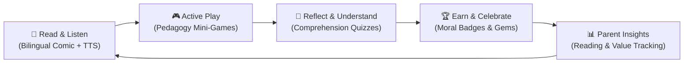

# 📚 KathaQuest (कथाक्वेस्ट)

<div align="center">


### **Transforming Traditional Indian Moral Stories into Interactive Digital Adventures**
*A gamified, bilingual storytelling & experiential learning ecosystem for young minds (Ages 4–9).*

[The Problem](#-the-problem) • [The Solution](#-the-solution) • [Our Vision](#-our-vision) • [Why It Matters](#-why-it-matters-impact) • [How It Works](#-how-it-works) • [Key Features](#-key-features) • [Tech Architecture](#-streamlined-architecture) • [Quick Start](#-quick-start)

</div>

---

## 🛑 The Problem

Modern childhood is facing a silent crisis of **passive digital consumption**:

* 📱 **The Short-Form Content Trap**: Children today spend hours consuming passive, algorithm-driven video feeds (reels, shorts, and cartoon streams). This constant passive stimulation shortens attention spans and erodes active reading habits.
* 📜 **Dying Bedtime Stories & Cultural Disconnect**: Timeless Indian folklore, Panchatantra, Jataka tales, and mythological wisdom that once instilled empathy and ethics are fading from modern households.
* 🧩 **Fragmented EdTech Solutions**: Existing apps are either dry digitized PDF readers that fail to excite children, or addictive arcade games devoid of cultural and moral values.
* 🌐 **Missing Bilingual Support & Parental Oversight**: Few educational platforms seamlessly bridge English and native Indian languages (such as Hindi in Devanagari) while keeping parents genuinely informed about their child's holistic growth.

> [!IMPORTANT]
> **The Core Challenge:** How can we leverage modern digital technology not to distract children, but to inspire them to read, reflect, and internalize core human values through active play?

---

## 💡 The Solution: KathaQuest

**KathaQuest (कथाक्वेस्ट)** transforms ancient Indian moral storytelling into an immersive, multi-sensory adventure. Rather than passively watching a video, children actively **Read, Listen, Play, Reflect, and Learn**.



KathaQuest combines:
1. **Interactive Bilingual Comics**: Visual panels with real-time, word-by-word synchronized audio narration and instant English ⇄ Hindi toggling.
2. **Pedagogy-Backed Mini-Games**: Actionable mini-games that physically embody the moral lesson of the chapter (e.g., pacing oneself like the tortoise).
3. **Reflective Value Quizzes**: Comprehension checkpoints that explain *"Why is this choice good?"* rather than penalizing mistakes.
4. **Offline-First Parent Corner**: A secure, gated dashboard with reading analytics, screen-time metrics, and moral growth milestones—free of ads or subscriptions.

---

## 🌟 Our Vision

> *"To preserve the timeless heritage of cultural storytelling by reimagining it for the digital generation—empowering every child to build strong reading habits, linguistic confidence, and moral character through purposeful play."*

We envision a world where screen time is not synonymous with distraction, but serves as a bridge to cultural literacy, empathy, and cognitive development. KathaQuest aligns directly with the **National Education Policy (NEP 2020)** goals: promoting early childhood bilingual education, mother-tongue familiarity, ethics, and experiential learning.

---

## 🎯 Why It Matters (Impact & Pedagogy)

| Impact Dimension | Traditional Media / Passive Video | The KathaQuest Impact |
| :--- | :--- | :--- |
| **Reading Habits** | Passive watching; zero text engagement. | **Active reading**: Word-by-word highlighted text synchronized with spoken audio reinforces phonics and vocabulary. |
| **Cognitive Engagement** | Rapid cuts induce overstimulation and low retention. | **Mindful interactions**: Pacing mechanics, calm breathing timers, and tactile steering foster focus and motor skills. |
| **Cultural Literacy** | Westernized or homogenized content dominating digital spaces. | **Living Indian Heritage**: Panchatantra, Jataka, and Indian folklore presented in vibrant, authentic art styles. |
| **Bilingual Mastery** | Apps are exclusively English or poorly translated. | **True Bilingual Fluidity**: Instant toggle between English and authentic Devanagari Hindi typography (`NotoSerifDevanagari`). |
| **Parental Connection** | Parents are locked out; no visibility into what is consumed. | **Meaningful Involvement**: Gated Parent Corner with reading minutes, moral progress, and offline wellness tracking. |
| **Child Safety & Well-being** | Ads, trackers, and predatory in-app purchases. | **100% Kid-Safe & Offline-First**: Zero ads, zero user tracking, and operates smoothly without continuous internet connectivity. |

---

## ✨ Key Features

### 📖 1. Interactive Bilingual Comic Reader
* **Synchronized Narration**: Spoken sentences and words illuminate in real-time as voice narration progresses, bridging oral and written fluency.
* **Instant Language Switching**: Toggle effortlessly between **English** and **Hindi** (`EN` ⇄ `हिन्दी`) at any step without losing reading position.
* **Living Characters**: Tap characters to reveal expressive animations, contextual speech bubbles, and delightful audio reactions.

### 🎮 2. Story-Integrated Moral Mini-Games
Four specialized gameplay mechanics reinforce emotional and cognitive development:
* 🐢 **Forest Trail Walk**: Hand-eye steering coordination guiding Timo the Tortoise through winding trails while collecting positive virtues.
* ⏱️ **Steady Pace Meter**: Teaches patience and emotional regulation by challenging children to keep pace inside a calm green "Steady Zone".
* 🎵 **Rhythm Steps**: Enhances auditory processing and timing with a two-lane musical beat-matching tapper.
* 🏁 **The Final Sprint**: A celebratory, high-energy dash to the finish line reinforcing perseverance over arrogance.
* 🧘 **Gentle Pacing (No Anxiety)**: Replaces stressful red countdown timers with soothing gold breathing pulses and encouraging 3-tier affirmations.

### 🧠 3. Reflection Quizzes & Value Learning
* **Constructive Explanations**: Interactive cards explain *"Why is this answer right?"* (*"यह सही क्यों है?"*), turning mistakes into positive learning moments.
* **Moral Reinforcement**: Questions test comprehension of character decisions, empathy, and ethical choices.

### 🔒 4. Parent Corner & Growth Analytics
* **Dynamic Arithmetic Gate**: Randomized math challenges prevent accidental access by toddlers while allowing easy entry for parents.
* **Learning & Screen-Time Analytics**: Visual tracking of active reading minutes, stories completed, and moral milestones achieved.
* **Healthy Habits**: Encourages balanced digital boundaries without aggressive notification spam or streaks.

---

## 🏗️ Streamlined Architecture

KathaQuest was built with a clean, decoupled architecture in **Flutter** to guarantee 60 FPS fluidity on low-cost tablets and mobile devices with zero heavy engine overhead.

```
┌─────────────────────────────────────────────────────────────┐
│                      Presentation Layer                     │
│  [Hero Splash]  [Adventure Map]  [Comic Reader]  [Minigames]│
└──────────────────────────────┬──────────────────────────────┘
                               │ Reactive Provider State
┌──────────────────────────────▼──────────────────────────────┐
│                         Core Engine                         │
│  [Audio & Ducking]  [Bilingual TTS]  [Tactile Haptics]     │
└──────────────────────────────┬──────────────────────────────┘
                               │ Offline Storage Engine
┌──────────────────────────────▼──────────────────────────────┐
│     LocalDatabase & SaveManager (Typed Offline DAOs)        │
│          Web (localStorage) | Native (App Storage)          │
└─────────────────────────────────────────────────────────────┘
```

### Core Technical Pillars

* **Unified Multi-Platform Engine**: Single Flutter & Dart codebase running natively across Web, Android, iOS, and Desktop.
* **Offline-First Data Layer**: Resilient local database (`LocalDatabase` & `SaveManager`) featuring debounced write batching and automated corruption recovery.
* **Audio & Speech Synchronization**: Native text-to-speech with word-boundary event binding (`onboundary`) and dynamic music ducking.
* **Lightweight 2D Canvas Engine**: Custom particle systems, parallax backgrounds, and sprite animations driven by hardware-accelerated `CustomPainter` without high GPU battery drain.

---

## 🚀 Quick Start

### Prerequisites
* [Flutter SDK](https://flutter.dev/docs/get-started/install) (v3.10 or higher)
* [Dart SDK](https://dart.dev/get-dart) (v3.0 or higher)
* Google Chrome, Android Studio, or target platform tools

### 1. Clone the Repository
```bash
git clone https://github.com/ritam4735/KathaQuest.git
cd KathaQuest
```

### 2. Install Dependencies
```bash
flutter pub get
```

### 3. Launch the Application
```bash
# Run in Google Chrome (Recommended)
flutter run -d chrome

# Or run on Android / Desktop
flutter run -d android
flutter run -d linux
```

### 4. Run Automated Tests
```bash
flutter test
```

---

## 🗺️ Project Roadmap

- [x] **Phase 1**: Interactive Bilingual Comic Engine & Synchronized Audio TTS.
- [x] **Phase 2**: 4 Pedagogical Mini-Games, Value Reflection Quizzes, & Parent Corner.
- [x] **Phase 3**: Android native configuration and multi-platform packaging.
- [ ] **Phase 4**: Expanded Indian Folklore Library (Panchatantra, Jataka, Birbal, Tenali Rama).
- [ ] **Phase 5**: Additional Regional Indian Languages (Bengali, Tamil, Telugu, Marathi).
- [ ] **Phase 6**: Offline voice recording for parents to narrate stories in their own voice.

---

<div align="center">

**Built for the Smart India Hackathon (SIH)**  
*Empowering children with moral wisdom, one story at a time.*

Made with ❤️ by Team KathaQuest

</div>
