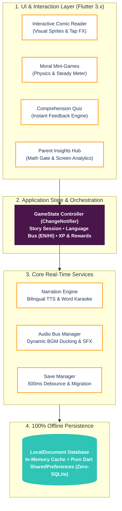
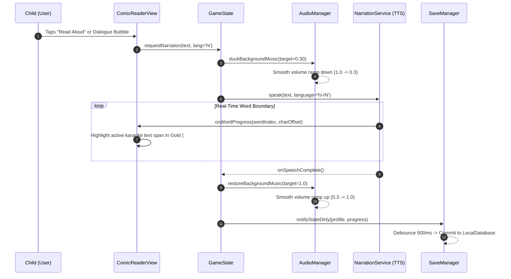
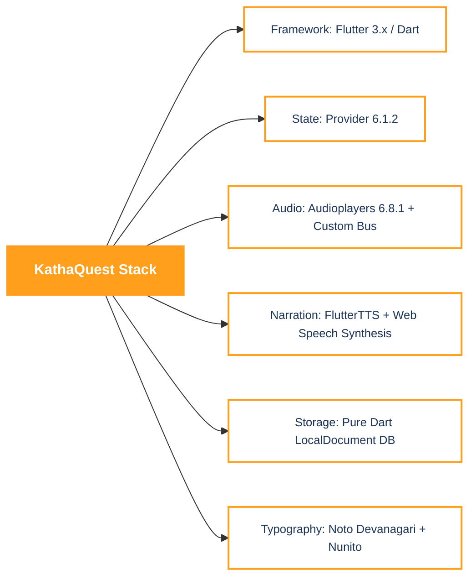

# SIH 2026: KathaQuest Technical Approach & Architecture

> [!NOTE]
> **Slide Objective**: Designed specifically for the **SIH 2026 Technical Approach Slide**. Minimalist, presentation-ready, high-signal, zero UML fluff, and understandable by judges in under 20 seconds.

---

## 1. System Architecture (Component Layering)

This architecture reflects the actual codebase structure of KathaQuest, organized into 4 distinct, clean layers.

### Mermaid Diagram


### Presentation Slide Visual (6 Clean Boxes)
```
┌────────────────────────────────────────────────────────────────────────┐
│                      FLUTTER EXPERIENCE LAYER                          │
│  [ Comic Reader ]   [ Mini-Games ]   [ Quiz Engine ]   [ Parent Hub ]  │
└───────────────────────────────────┬────────────────────────────────────┘
                                    │ User Inputs / Events
                                    ▼
┌────────────────────────────────────────────────────────────────────────┐
│                  CENTRAL GAMESTATE (PROVIDER BUS)                      │
│     Active Story Session  •  Bilingual State  •  Level / XP Logic      │
└───────────────────┬───────────────────────────────┬────────────────────┘
                    │                               │
       Audio Ducking & Narration         Auto-Save & Metrics
                    ▼                               ▼
┌───────────────────────────────────────┐ ┌──────────────────────────────┐
│       AUDIO & NARRATION ENGINE        │ │         SAVE MANAGER         │
│  • Cross-Platform Audio Manager       │ │  • 500ms Debounced Commits   │
│  • Bilingual TTS (EN/HI)              │ │  • Corrupt Backup Recovery   │
│  • Word-Level Karaoke Synchronization │ │  • Schema Migration Engine   │
└───────────────────────────────────────┘ └──────────────┬───────────────┘
                                                         │
                                                         ▼
┌────────────────────────────────────────────────────────────────────────┐
│                   OFFLINE-FIRST LOCAL STORAGE (100%)                   │
│   Pure Dart LocalDocument DB • In-Memory Cache • Zero C++ Dependencies │
└────────────────────────────────────────────────────────────────────────┘
```

---

## 2. End-to-End Application Workflow

From app cold launch to parental literacy insights.

### Mermaid Flowchart


### Screen Flow Breakdown
| Stage | Component / Screen | Code Reference | Key Technical Mechanism |
|---|---|---|---|
| **1. Startup** | Hero Splash | [`hero_splash_screen.dart`](file:///home/ritam/Playground/projects/sih/KathaQuest/lib/screens/splash/hero_splash_screen.dart) | 9-layer parallax animation + asynchronous asset precaching |
| **2. Discovery** | Main Shell & Library | [`main_shell_screen.dart`](file:///home/ritam/Playground/projects/sih/KathaQuest/lib/screens/main_shell_screen.dart) | 5-tab navigation shell with custom pill bottom navigation |
| **3. Story** | Comic Reader | [`comic_reader_view.dart`](file:///home/ritam/Playground/projects/sih/KathaQuest/lib/features/comic/comic_reader_view.dart) | Tap-reaction sprites, speech bubbles, bilingual toggle |
| **4. Mechanic** | Mini-Game | [`minigame_view.dart`](file:///home/ritam/Playground/projects/sih/KathaQuest/lib/features/minigames/minigame_view.dart) | Moral pacing mechanic (e.g., Steady Meter in Tortoise & Hare) |
| **5. Assessment** | Quiz View | [`quiz_view.dart`](file:///home/ritam/Playground/projects/sih/KathaQuest/lib/features/quiz/quiz_view.dart) | Instant feedback animation, haptic cues, score aggregation |
| **6. Reward** | Reward Screen | [`reward_screen.dart`](file:///home/ritam/Playground/projects/sih/KathaQuest/lib/screens/reward_screen.dart) | Particle confetti, dynamic level progression calculation |
| **7. Persist** | Save Manager | [`save_manager.dart`](file:///home/ritam/Playground/projects/sih/KathaQuest/lib/core/save_manager.dart) | 500ms debounce timer, auto-healing corrupt backup fallback |
| **8. Insights** | Parent Corner | [`parent_corner_screen.dart`](file:///home/ritam/Playground/projects/sih/KathaQuest/lib/screens/parent_corner_screen.dart) | Math gate verification, reading minutes, quiz accuracy charts |

---

## 3. Real-Time Feature Interaction Engine

How the concurrent subsystems coordinate during active reading:



### Concurrency Highlights
1. **Dynamic Audio Ducking**: Background music automatically ramps down to 30% volume when TTS triggers, guaranteeing speech intelligibility for early readers, then smoothly restores when speech finishes.
2. **Word-Boundary Karaoke Sync**: `NarrationService` emits character offset callbacks via a `ValueNotifier<int>` directly driving Flutter's `RichText` span highlights at 60 FPS without rebuilding entire screen trees.
3. **500ms Debounced Persistence**: Rapid child interactions (swiping pages, collecting coins) do not hammer storage I/O. State modifications are coalesced in memory and flushed once idle.

---

## 4. Production Technical Stack Matrix



| Layer | Technology | Code Reference | Why It Was Chosen |
|---|---|---|---|
| **Framework** | Flutter 3.x / Dart | [`pubspec.yaml`](file:///home/ritam/Playground/projects/sih/KathaQuest/pubspec.yaml) | Single codebase compiled natively for Android, Web, and Desktop with 60 FPS animations. |
| **State** | Provider (`ChangeNotifier`) | [`game_state.dart`](file:///home/ritam/Playground/projects/sih/KathaQuest/lib/state/game_state.dart) | Predictable, lightweight reactive state tree without boilerplate overhead of Bloc or Redux. |
| **Narration** | Hybrid TTS Architecture | [`narration_service.dart`](file:///home/ritam/Playground/projects/sih/KathaQuest/lib/core/narration/narration_service.dart) | Conditional compilation: Web Speech Synthesis for browsers, `flutter_tts` for native mobile. |
| **Audio** | Audioplayers 6.8.1 | [`audio_manager.dart`](file:///home/ritam/Playground/projects/sih/KathaQuest/lib/core/audio_manager.dart) | Low-latency SFX preloading + concurrent dual-stream playback (BGM + voice). |
| **Storage** | LocalDocument DB | [`local_database.dart`](file:///home/ritam/Playground/projects/sih/KathaQuest/lib/core/database/local_database.dart) | In-memory cache + SharedPreferences. Zero SQLite compilation issues; runs 100% offline. |
| **Design** | Saffron Palette & Noto Font | [`app_theme.dart`](file:///home/ritam/Playground/projects/sih/KathaQuest/lib/core/app_theme.dart) | Culturally authentic Indian aesthetic with full Hindi Devanagari typographic support. |

---

## 5. Technical Moats (Why This Beats Generic EdTech)

| Moat | Conventional EdTech Apps | KathaQuest Architecture |
|---|---|---|
| **Connectivity** | Requires cloud API calls / online connection | **100% Offline-First**: Zero external server dependencies for playback, scoring, or save states. |
| **Bilingual Literacy** | Static translated text | **Live Audio-Visual Karaoke**: Real-time word highlighting synced to bilingual TTS in English and Hindi. |
| **Pedagogical Gameplay** | Disconnected mini-games (e.g. random flappy bird) | **Narrative-Mechanic Coupling**: Game mechanics enforce the moral (e.g. patience meter required to win). |
| **Hardware Footprint** | Heavy 3D engines (Unity/Unreal) eating battery | **Ultralight 2D Vector & Canvas**: Flawless 60 FPS performance even on low-cost ₹6,000 Android phones. |

---

## 6. Slide-Ready Vector Graphic (SVG)

You can copy this SVG directly into Figma, PowerPoint, or Google Slides:

```xml
<svg xmlns="http://www.w3.org/2000/svg" viewBox="0 0 1200 675" width="100%" height="100%">
  <rect width="1200" height="675" fill="#FFFFFF"/>
  
  <!-- Slide Header -->
  <text x="60" y="70" font-family="system-ui, -apple-system, sans-serif" font-size="32" font-weight="800" fill="#1D3557">TECHNICAL ARCHITECTURE &amp; DATA FLOW</text>
  <text x="60" y="102" font-family="system-ui, -apple-system, sans-serif" font-size="16" font-weight="500" fill="#FF9F1C">KathaQuest • 100% Offline-First • Cross-Platform Engine</text>
  <line x1="60" y1="120" x2="1140" y2="120" stroke="#E2E8F0" stroke-width="2"/>

  <!-- Box 1: UI Layer -->
  <rect x="60" y="150" width="1080" height="95" rx="14" fill="#FFF9F2" stroke="#FF9F1C" stroke-width="2.5"/>
  <text x="90" y="182" font-family="sans-serif" font-size="14" font-weight="800" fill="#FF9F1C" letter-spacing="1">1. PRESENTATION &amp; EXPERIENCE LAYER (FLUTTER 3.x)</text>
  <rect x="90" y="195" width="230" height="35" rx="8" fill="#FFFFFF" stroke="#FFD8A8" stroke-width="1.5"/>
  <text x="115" y="218" font-family="sans-serif" font-size="13" font-weight="600" fill="#1D3557">Interactive Comic Reader</text>
  <rect x="340" y="195" width="230" height="35" rx="8" fill="#FFFFFF" stroke="#FFD8A8" stroke-width="1.5"/>
  <text x="365" y="218" font-family="sans-serif" font-size="13" font-weight="600" fill="#1D3557">Moral Mini-Games</text>
  <rect x="590" y="195" width="230" height="35" rx="8" fill="#FFFFFF" stroke="#FFD8A8" stroke-width="1.5"/>
  <text x="615" y="218" font-family="sans-serif" font-size="13" font-weight="600" fill="#1D3557">Comprehension Quiz</text>
  <rect x="840" y="195" width="270" height="35" rx="8" fill="#FFFFFF" stroke="#FFD8A8" stroke-width="1.5"/>
  <text x="860" y="218" font-family="sans-serif" font-size="13" font-weight="600" fill="#1D3557">Parent Analytics Dashboard</text>

  <!-- Arrow 1 -->
  <path d="M 600 245 L 600 275" stroke="#FF9F1C" stroke-width="3" stroke-linecap="round"/>
  <polygon points="600,282 594,270 606,270" fill="#FF9F1C"/>

  <!-- Box 2: State Layer -->
  <rect x="60" y="285" width="1080" height="85" rx="14" fill="#FBF5FB" stroke="#4A154B" stroke-width="2.5"/>
  <text x="90" y="317" font-family="sans-serif" font-size="14" font-weight="800" fill="#4A154B" letter-spacing="1">2. REACTIVE STATE ORCHESTRATION (PROVIDER BUS)</text>
  <text x="90" y="345" font-family="sans-serif" font-size="14" font-weight="500" fill="#475569">Active Story Session Controller • Bilingual Language Bus (English/Hindi) • Player XP &amp; Reward Dispatcher</text>

  <!-- Dual Branch Arrows -->
  <path d="M 330 370 L 330 405" stroke="#FF9F1C" stroke-width="3" stroke-linecap="round"/>
  <polygon points="330,412 324,400 336,400" fill="#FF9F1C"/>
  <path d="M 870 370 L 870 405" stroke="#FF9F1C" stroke-width="3" stroke-linecap="round"/>
  <polygon points="870,412 864,400 876,400" fill="#FF9F1C"/>

  <!-- Box 3A: Audio & Narration -->
  <rect x="60" y="415" width="520" height="110" rx="14" fill="#F8FAFC" stroke="#CBD5E1" stroke-width="2"/>
  <text x="90" y="445" font-family="sans-serif" font-size="14" font-weight="800" fill="#1D3557">AUDIO &amp; NARRATION ENGINE</text>
  <text x="90" y="475" font-family="sans-serif" font-size="13" font-weight="500" fill="#475569">• Dynamic BGM Ducking (100% → 30% during speech)</text>
  <text x="90" y="500" font-family="sans-serif" font-size="13" font-weight="500" fill="#475569">• Real-Time Karaoke Word Boundary Synchronization</text>

  <!-- Box 3B: Save Manager -->
  <rect x="620" y="415" width="520" height="110" rx="14" fill="#F8FAFC" stroke="#CBD5E1" stroke-width="2"/>
  <text x="650" y="445" font-family="sans-serif" font-size="14" font-weight="800" fill="#1D3557">SAVE MANAGER &amp; PERSISTENCE</text>
  <text x="650" y="475" font-family="sans-serif" font-size="13" font-weight="500" fill="#475569">• 500ms Debounced Async State Commits</text>
  <text x="650" y="500" font-family="sans-serif" font-size="13" font-weight="500" fill="#475569">• Automated Schema Migration &amp; Corrupt Backup Fallback</text>

  <!-- Arrow to Storage -->
  <path d="M 870 525 L 870 550" stroke="#2EC4B6" stroke-width="3" stroke-linecap="round"/>
  <polygon points="870,557 864,545 876,545" fill="#2EC4B6"/>

  <!-- Box 4: Offline Storage -->
  <rect x="60" y="560" width="1080" height="75" rx="14" fill="#F0FDF4" stroke="#2EC4B6" stroke-width="2.5"/>
  <text x="90" y="590" font-family="sans-serif" font-size="14" font-weight="800" fill="#00897B" letter-spacing="1">4. 100% OFFLINE PERSISTENCE (LOCAL DOCUMENT DATABASE)</text>
  <text x="90" y="615" font-family="sans-serif" font-size="13" font-weight="500" fill="#15803D">In-Memory Fast Cache + Pure Dart SharedPreferences (Zero Native SQLite C++ dependencies, universal compatibility)</text>
</svg>
```

---

## 7. Judge Pitch Script (20 Seconds)

> *"Judges, while generic edtech apps rely on constant cloud connectivity and heavy 3D game engines, KathaQuest is engineered with an **offline-first, ultralight architecture**.*
>
> *Our UI layer pairs interactive comics and moral mini-games with a **reactive GameState controller**. Under the hood, our custom narration engine coordinates **real-time bilingual TTS with word-level karaoke sync**, while our audio manager dynamically ducks background music for optimal intelligibility.*
>
> *All child progress is committed via a **500ms debounced save pipeline** into a pure Dart local document store—guaranteeing 60 frames per second and zero cloud dependency even on budget ₹6,000 devices."*
